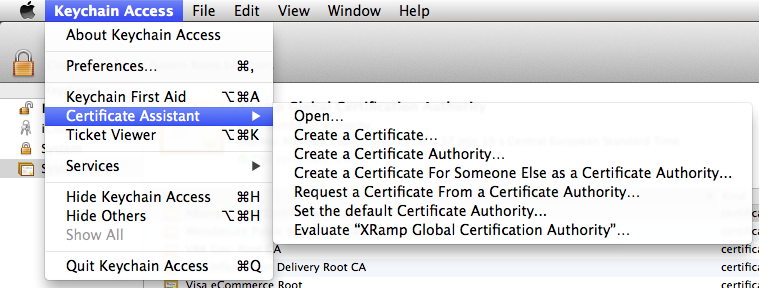
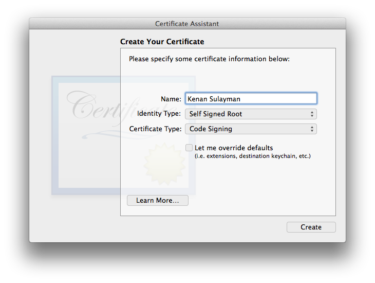
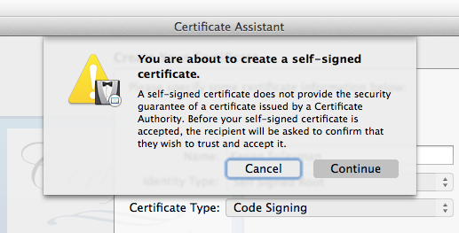
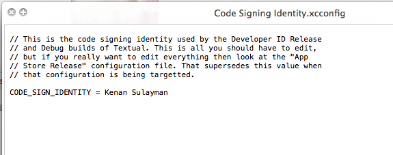
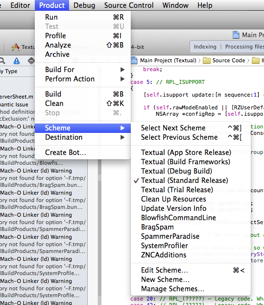
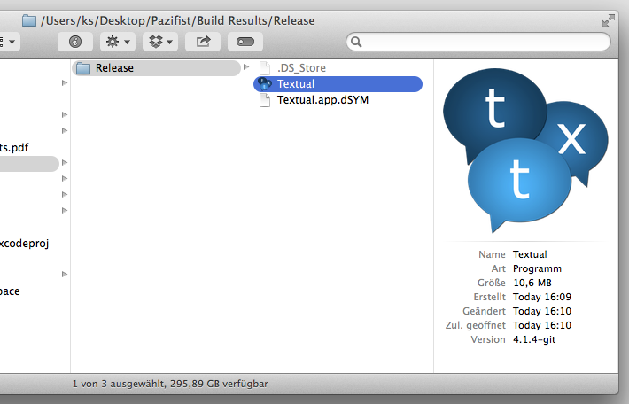

Textual is a highly modified version of the open source project known as [LimeChat](https://github.com/psychs/limechat) created by Satoshi Nakagawa. Much of the app uses the open standard of [WebKit](http://webkit.org/) which makes customization easy through the use of CSS 3 and HTML 5. [Plugins](http://www.codeux.com/textual/wiki/Writing-Plugins.wiki) written in Objective-C and [scripts](http://www.codeux.com/textual/wiki/Writing-Scripts.wiki) made with AppleScript (and other languages) are also supported.

## Obtaining Pazifist
- Simply download the most recent release, if you fancy not to compile yourself.

## Building Pazifist

##1. Create a certificate
	If you have a valid Apple Mac Developer certificate, skip this step. This step creates a self-signed certificate.

### **Keychain Access**
- Open the Certificate Assistant

- Create a new code signing certificate

- Install and trust the certificate

##2. Specify your certificate
 - Pazifist -> Resources -> Build Configurations -> Code Signing Identity.xcconfig
- Specify your certificate

##3. Build
 - Open Pazifist in Xcode
 - Product -> Scheme -> Textual (Standard Release)

 - cmd + b
 - Grab your Textual.app in **Textual/Build Results/Release**.

### License

See LICENSE for more information.
